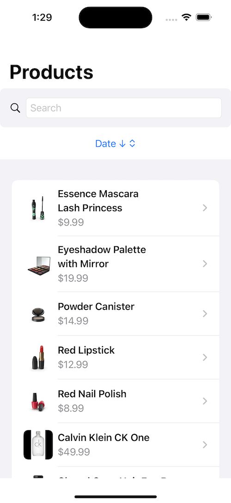

# SampleApp-SwiftUI- Listing - Search items with throttling

**This Sample App** is a demo iOS app built with SwiftUI to showcase products and allow users to search, sort, and paginate through them efficiently. The app interacts with a remote API to fetch product data and displays it in a clean, user-friendly interface.

## Features

- **Product Search**: Allows users to search for products using a search bar.
- **Sorting Options**: Sort products by title, price, or date, either ascending or descending.
- **Pagination**: Load products incrementally as users scroll down the list.
- **Error Handling**: Displays error messages when network issues occur, with retry options.
- **UI Tests**: Automated UI tests to ensure the search functionality works as expected.
- **Unit Tests**: Automated Unit tests to ensure the search functionality works as expected.

## Screenshots

### 1. **Home Screen**


### 2. **Search Results**


### 3. **Sort Options**


### 3. **Sort Options**


## Installation

Clone this repository:
   ```bash
   git clone https://github.com/mfa01/SampleApp-SwiftUI.git
